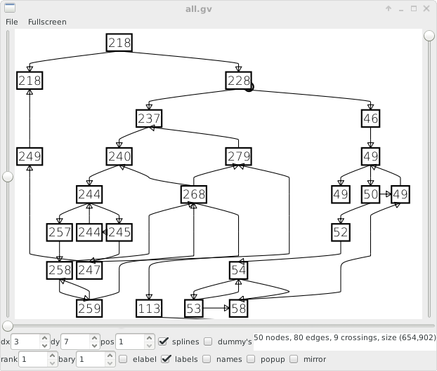
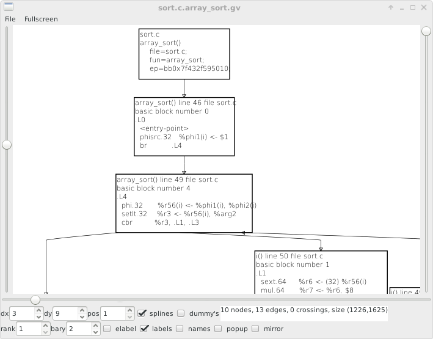
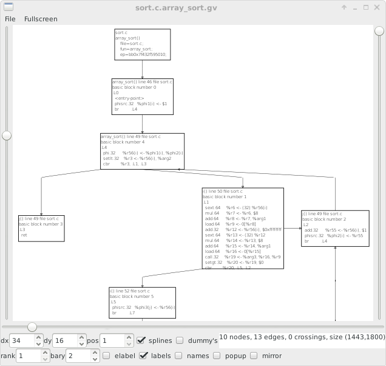

# sparsegv
generate graph data from C source using Linux kernel sparse tool  
  
This is sparsegv a tool to generate graphviz dot data from C source code and rendered svg images during compilation  
This is a modified version of the Linux kernel sparse tool to check C source version 0.6.3 July 2021  
  
The generated textual dot graph gv files can be used with gml4gtk graph viewer or dot pogram  
  
To compile:  
make  
cd src  
./sparsegv ssa.c  
see also the sparse documentation and cgcc how to run the sparse tool  
  
During running this program generates a all.gv graphviz dot graph file with all graph data  
For every function in every file a small graph is generated with the basic block instructions  
  
In the directory docs are the sparse 0.6.3 documents from the website as pdf files  
In directory examples is example graph output and svg callgraph images generated with sparsegv  
In directory orig is the snapshot of the sparse tool july 2021 version 0.6.3  
  
The sparse tool has a MIT license and the graph layout routines are GNU GPL version 3+  
  
The sparse tool has a llvm based compiler backend then it can generate executable binaries  
  
When using the GNU GCC compiler a callgraph can be generated with option -fcallgraph-info and the ci file can be used with gml4gtk graph viewer on sourceforge  
  
  
  
  
  
Links:  
https://sparse.docs.kernel.org/en/latest/  
https://www.kernel.org/doc/html/v4.12/dev-tools/sparse.html  
https://mirrors.edge.kernel.org/pub/software/devel/sparse/dist/  
the sparse maillinglist is the place to ask questions about sparse tool  
and the maillinglist has the description of details of the sparse C source  
   
graph viewer for dot files with GTK+ gui  
https://sourceforge.net/projects/gml4gtk/  
  
for windows compilation there is w64devkit with newest gcc compiler  
https://github.com/skeeto/w64devkit  
  
Todo:
generate textual gml graph files to be used with tulip, ogdf. networkx, graphia, gephi, graph-tool, graphlet, igraph and more  
add sfg.c to generate images during compilation  
add complexity and other graph info at and of data  
  
SPDX-License-Identifier: GPL-3.0+  
License-Filename: LICENSE  
  

  
